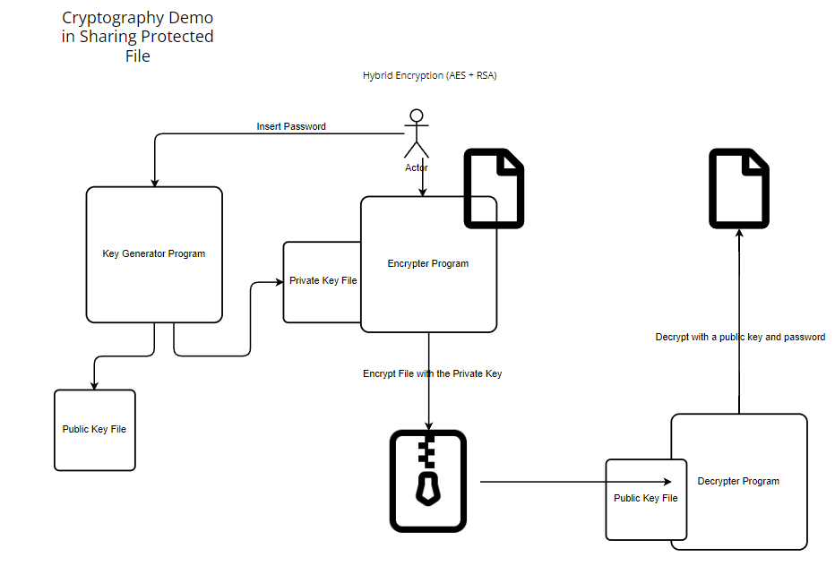

# Cryptography Demo - Sharing Protected File Demo

Cryptography Demo - Sharing Protected File written in .NET Core, C#. Demonstrated Hybrid Encryption technique in sharing protection file using private key file and public key file.
This technique can be used in many are including Voucher Generation, Telco Soft Pin Sharing, etc.

## Author
Tea Bin Xiong

## Architecture Diagram

## Projects
1) KeyGen - [src/File.Encrypter/File.Encrypter.KeyGen](src/File.Encrypter/File.Encrypter.KeyGen)
File.Encrypter.KeyGen can be used to generate the Public Key File and Private Key File. 

2) Encrypter -  [File.Encrypter.EncryptTool](src/File.Encrypter/File.Encrypter.EncryptTool)
File.Encrypter.EncryptTool can be used to encrypt target file with a Private Key.

3) Decrypter - [File.Encrypter.DecryptTool](src/File.Encrypter/File.Encrypter.DecryptTool) 
File.Encrypter.DecryptTool can be used to decrypt target file with a Public Key & a password.

## Repository URL
[cdr-inserter-demo](https://github.com/teabinxiong/safe-file-encrypter-demo)
